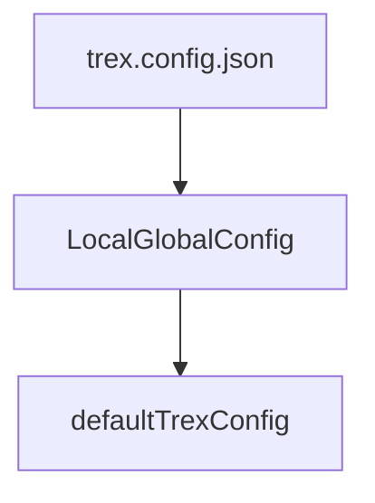

<h1 align="center">Trex 🦕</h1>

<p align="center">
  
  <p align="center">Package management for deno (pronounced "tee rex") </p>
</p>

<p align="center">
   <a href="https://github.com/crewdevio/Trex/issues">
     
   </a>
   <a href="https://github.com/crewdevio/Trex/network">
     
   </a>
   <a href="https://github.com/crewdevio/Trex/stargazers">
     
   </a>
   <a href="https://github.com/crewdevio/Trex/blob/master/LICENSE">
     
   </a>
   <a href="https://deno.land">
     
   </a>
   <a href="https://nest.land/package/Trex">
     
   </a>
</p>


## About

Trex is a package management tool for deno similar to npm but keeping close to
the deno philosophy. Packages are cached and only one `import_map.json` file is
generated.

```javascript
// import_map.json

{
  "imports":  {
    "http/":  "https://deno.land/std/http/"
  }
}
```

For more information about the import maps in deno see
[import maps](https://deno.land/manual/linking_to_external_code/import_maps).

## Additional topics

- [Proxy](docs/proxy.md)

- [Integration with nest.land](docs/nest_land_setup.md)

- [How can I have my package available to download with
  Trex?](docs/add_package.md)

## Installation

```console
deno install -A --unstable --import-map=https://deno.land/x/trex/import_map.json -n trex --no-check https://deno.land/x/trex/cli.ts
```

> **Note**: Works with deno >= 1.10.2

**We shorten the install command so it's not that long**

The permissions that Trex uses are:

- `--allow-net`
- `--allow-read`
- `--allow-write`
- `--allow-run`
- `--allow-env`

You can give those permissions explicitly.

## Updating Trex

Install new version with the `-f` flag:

```console
deno install -f -A --unstable --import-map=https://deno.land/x/trex/import_map.json -n trex --no-check https://deno.land/x/trex/cli.ts
```

Or use the `upgrade` command:

```console
trex upgrade
```

> **Note**: available for versions 0.2.0 or higher.   

> **Note**: to try the latest pre-release features, use the `--canary` flag.

Verify the installation of Trex:

```console
trex --version
```

The console should print the Trex version.  

For help on the commands that Trex provides, use:

```console
trex --help
```

## Usage

### Installing from deno.land

Use the `--map` flag to install packages from the [Standard Library](https://deno.land/std) (`std`) and those hosted at `deno.land/x`.

#### Example

Install the `fs`, `http` and `fmt` modules from `std`:

```console
trex install --map fs http fmt
```

> **Note**: you can also use the shorthand `i`, as in: `trex i --map fs http fmt`

### Installing from nest.land

Use the `--nest` flag and **specify an explicit version** to install packages hosted on [nest.land](https://nest.land/gallery).

```console
trex install --nest [pkg]@[version]
```

#### Examples

```console
trex install --nest opine@0.13.0
```

```console
trex i --nest etag@0.0.2
```

You can install `std` packages from `nest.land` by specifying the package and version:

```console
trex install --nest fs@0.61.0
```

### Installing from a repository

```console
trex install --pkg [user]/[repo or repo@tag/branch]/[path/to/file] [packageName]
```

#### Example

```console
trex install --pkg oakserver/oak@main/mod.ts oak
```

> **Warning**: In the event that the repository uses a branch other than master as
> the main branch, this **must be specified**!

The above downloads oak directly from its repository.

### Example import map

All installation methods produce an `import_map.json` file:

```json
{
  "imports": {
    "fs/": "https://deno.land/std/fs/",
    "http/": "https://deno.land/std/http/",
    "fmt/": "https://deno.land/std/fmt/"
  }
}
```

### Downloading packages

Download all the packages listed in the `import_map.json` similar to
`npm install`:

```console
trex install
```

### Adding custom packages

Install a package from a custom URL source:

```console
trex --custom React=https://dev.jspm.io/react/index.js
```

```jsonc
// import_map.json
{
  "imports": {
    "http/": "https://deno.land/std/http/",
    "fmt/": "https://deno.land/std/fmt/",
    "oak": "https://deno.land/x/oak/mod.ts",
    "React": "https://dev.jspm.io/react/index.js"
  }
}
```

### Deleting packages

```console
trex delete React
```

Remove a specific version from the cache and the `import_map.json` file:

```console
trex delete fs@0.52.0
```

```jsonc
// import_map.json
{
  "imports": {
    "fs/": "https://deno.land/std/fs/",
    "http/": "https://deno.land/std/http/",
    "fmt/": "https://deno.land/std/fmt/",
    "oak": "https://deno.land/x/oak/mod.ts"
  }
}
```

> **Note**: Removing from cache only works with packages from `std` and `deno.land/x`

### Installing an explicit version of a package

Specify a package's version:

```console
trex install --map fs@0.54.0
```

```jsonc
// import_map.json
{
  "imports": {
    "fs/": "https://deno.land/std@0.54.0/fs/"
  }
}
```

> **Note**: can be used with third party packages.

### Checking for outdated dependencies

```console
trex check
```
> **Warning**: Currently limited to packages from [`deno.land/std`](https://deno.land/std) and [`deno.land/x`](https://deno.land/x),
> in future versions this will support third party registries and CDN sources as well.

### Run Scripts with `run.json`

You can create command aliases, similar to `deno task` or [`npm run`](https://docs.npmjs.com/cli-commands/run-script.html).  

Simply create a **`run.json`** file with the following structure:

```json
{
  "scripts": {
    "welcome": "deno run https://deno.land/std@0.71.0/examples/welcome.ts"
  }
}
```

#### Aliasing external commands

You can call a command from within another, or call a script like `denopack`
or `eggs update` from within a command alias:

```jsonc
// run.json
{
  "scripts": {
    "start": "trex run welcome",
    "welcome": "deno run https://deno.land/std@0.71.0/examples/welcome.ts",
    "dev": "denon run ./app.ts",
    "build": "aleph build",
		"update": "eggs update"
  }
}
```

Then, for example, to update your dependencies:

```console
trex run update
```
> This will execute `eggs update`


#### Installation life cycle

When the command `trex install` or `trex i` executed, you can perform actions
before and after the execution of `trex install`.

**Execution order**:

1. `preinstall`
2. `install`
3. `postinstall`

```jsonc
// run.json
{
  "scripts": {
    "start": "trex run welcome",
    "welcome": "deno run https://deno.land/std@0.71.0/examples/welcome.ts",
    "dev": "denon run ./app.ts",
    "build": "aleph build",
    "preinstall": "deno --version",
    "postinstall": "deno test --unstable"
  }
}
```

> **Note**: you can use the --watch flag to monitor the changes and rerun the
> script, example:

```sh
deno run --watch --unstable https://deno.land/std@0.71.0/examples/welcome.ts
```

#### Passing arguments to aliases

You can provide arguments when calling the command alias. These will be passed to the file to execute:

```console
trex run start --port=3000 --env
```

```typescript
console.log(Deno.args); // ["--port=3000", "--env"]
```

#### Reboot Script Alias Protocol (or _RSAP_)

With trex you can create script aliases that reload every time a file is
changed, similar to running deno with the `--watch` flag.

The Reboot Script Alias Protocol (RSAP) provides this same functionality.
Just add a `files` property to your `run.json` file, specifying an array
of files that will be watched. When changes are detected in those files,
your script aliases will be restarted immediately.

```jsonc
// run.json
{
  "scripts": {
    "start": "trex run welcome",
    "dev": "denon run ./app.ts",
    "build": "aleph build"
  },
  "files": ["./app.ts"]
}
```

You only have to add the `files` option in the `run.json` file and it will only
observe the files and folders that you specify, if you leave the array empty it
will observe all the files.

```jsonc
// run.json
{
  "scripts": {
    "dev": "go build"
  },
  "files": ["./main.go"]
}
```

For the script alias to use `rsap` you just need to add the `--watch` or `-w`
flag to the end of the command alias:

```console
trex run dev --watch [...args]
```

It can be used with any CLI tool, compiler or interpreter.

#### YAML is also acceptable (`run.yml` or `run.yaml`)

```yaml
- scripts:
    dev: go build
- files:
    - ./main.go
```

#### Limitations

A limitation of watch mode is that they **do not** restart the processes that never
end (such as http servers). In those cases we recommend other alternatives, such as
[denon](https://deno.land/x/denon).

### Virtual cli tool execution

`trex exec` allows you to run many cli tools hosted at `deno.land/x`

```console
trex exec aleph init hello_world
```

trex will fetch aleph's cli and run without installing it locally using
`deno install`, you can also specify the version you want to use.

```console
trex exec aleph@v0.2.28 init hello_world
```

#### Permissions (perms)

You can also specify the permissions that the cli will use. 
Just pass the `--perms` flag followed by comma-separated permissions:

```console
trex exec --perms env,read,write,net denon run ./app.ts
```

- `env`: --allow-env
- `write`: --allow-write
- `read`: --allow-read
- `net`: --allow-net
- `run`: --allow-run
- `reload`: --reload
- `plugin`: --allow-plugin
- `hrtime`: --allow-hrtime
- `A`: --allow-all

> **Warning**: if you don't specify the permissions, they are **all** automatically granted to you

You can also combine this with the command alias:

```jsonc
// run.json
{
  "scripts": {
    "denon": "trex exec denon run"
  },
  "files": ["./app.ts"]
}
```

```console
trex run denon ./app.ts
```

And yes, you can do this:

```console
trex exec trex exec trex exec ....
```

Even this:

```console
trex exec land trex exec land trex exec ....
```

This functionality is heavily inspired by
[npx](https://docs.npmjs.com/cli/v7/commands/npx) and
[land](https://deno.land/x/land). If you need another alternative to `trex exec`
to use in `deno`, [land](https://deno.land/x/land) this is a great option.

### Local configuration and global configuration (experimental)

When you work with import maps trex by default will handle everything using an
import_map.json file, but what if I want to use an import-map.json or an
importMap.json instead?

That's what the global settings are for! Basically it allows you to change the
behavior of trex, with respect to the file where the dependencies will be
handled.

#### Example

```console
trex global-config --importMap=import-map.json
```

This will change the default name from import_map.json to import-map.json. to
obtain the name or format used you must execute the following command.

```console
trex global-config --getImportMap
```

But what happens if I am working with several people on the same project and we
have different configurations? For these cases there is the local configuration
or local configuration file - `trex.config.json`:

```jsonc
// trex.config.json
{
  "importMap": "importMap.json"
}
```

This will tell trex that the format for the import map will be the one dictated
by the config file. This allows that there are no problems with the different
local configurations of each developer since the configuration file only affects
the scope of the project.

> **Note**: the file `trex.config.json` must be at the same level(scope) as the
> import map for trex to detect it.

Thee hierarchy that trex respects with the configurations is the following:



### Purge a package or URL

If you want delete a package or url package from cache memory in deno, you can
use the `purge` command to remove from cache memory.

```console
trex purge oak
```

This finds the `oak` package in the `import_map.json`, and removes it from the
cache.

#### Purging with full URL specifiers

```console
trex purge https://deno.land/x/oak@v6.3.1/mod.ts
```

### Checking a package's dependency tree

```console
trex tree fs
```

This prints out something like:

```console
local: C:\Users\trex\AppData\Local\deno\deps\https\deno.land\434fe4a7be02d1875....
type: TypeScript
compiled: C:\Users\trex\AppData\Local\deno\gen\https\deno.land\std\fs\mod.ts.js
map: C:\Users\trex\AppData\Local\deno\gen\https\deno.land\std\fs\mod.ts.js.map
deps:
https://deno.land/std/fs/mod.ts
  ├─┬ https://deno.land/std/fs/empty_dir.ts
  │ └─┬ https://deno.land/std/path/mod.ts
  │   ├── https://deno.land/std/path/_constants.ts
  │   ├─┬ https://deno.land/std/path/win32.ts
  │   │ ├── https://deno.land/std/path/_constants.ts
  │   │ ├─┬ https://deno.land/std/path/_util.ts
  │   │ │ └── https://deno.land/std/path/_constants.ts
  │   │ └── https://deno.land/std/_util/assert.ts
  │   ├─┬ https://deno.land/std/path/posix.ts
  │   │ ├── https://deno.land/std/path/_constants.ts
  │   │ └── https://deno.land/std/path/_util.ts
  │   ├─┬ https://deno.land/std/path/common.ts
  │   │ └─┬ https://deno.land/std/path/separator.ts
  │   │   └── https://deno.land/std/path/_constants.ts
  │   ├── https://deno.land/std/path/separator.ts
  │   ├── https://deno.land/std/path/_interface.ts
  │   └─┬ https://deno.land/std/path/glob.ts
  │     ├── https://deno.land/std/path/separator.ts
  │     ├─┬ https://deno.land/std/path/_globrex.ts
  │     │ └── https://deno.land/std/path/_constants.ts
  │     ├── https://deno.land/std/path/mod.ts
  │     └── https://deno.land/std/_util/assert.ts
  ├─┬ https://deno.land/std/fs/ensure_dir.ts
	
# ... full response was truncated for brevity
```

### Integrity checking & lock files

Let's say your module depends on a remote module. When you compile your module
for the first time, it is retrieved, compiled and cached. It will remain this
way until you run your module on a new machine (e.g. in production) or reload
the cache.

But what happens if the content in the remote url is changed? This could lead to
your production module running with different dependency code than your local
module. Deno's solution to avoid this is to use integrity checking and lock
files.

Create a lockfile:

```console
deno cache --lock=lock.json --lock-write file.ts
```

The above generates a `lock.json` file.

If you use `import_map.json` in input file, you can specify it:

```console
deno cache --lock=lock.json --lock-write --import-map=import_map.json --unstable file.ts
```

See
[deno document](https://deno.land/manual/linking_to_external_code/integrity_checking)
for more info.

## Complete example

### Simple std server

#### Install `http` and `fmt`:

```console
trex install --map http fmt
```

#### Create a simple server

```typescript
// server.ts
import { serve } from "http/server.ts";
import { green } from "fmt/colors.ts";

const server = serve({ port: 8000 });
console.log(green("http://localhost:8000/"));

for await (const req of server) {
  req.respond({ body: "Hello World\n" });
}
```

#### Start the server

```console
deno run --allow-net --import-map=import_map.json --unstable server.ts
```

> **Warning**: it is important to use **--import-map=import_map.json --unstable**

### Adding third-party packages: Example using [oak](https://deno.land/x/oak)

#### Install the master version of `oak`

```console
trex i --map oak
```

This adds `oak` to the `import_map.json` file:

```json
{
  "imports": {
    "http/": "https://deno.land/std/http/",
    "fmt/": "https://deno.land/std/fmt/",
    "oak": "https://deno.land/x/oak/mod.ts"
  }
}
```

#### Then create an oak application. 

Note the `import` statement, thanks to the `import_map.json` addition:

```typescript
// app.ts
import { Application } from "oak";

const app = new Application();

app.use((ctx) => {
  ctx.response.body = "Hello World!";
});

await app.listen({ port: 8000 });
```

#### Run the server

```console
deno run --allow-net --import-map=import_map.json --unstable app.ts
```

> **Warning**: it is important to use **--import-map=import_map.json --unstable**

## Contributing

Contributions are welcome, see [CONTRIBUTING GUIDELINES](CONTRIBUTING.md).

## Licensing

Trex is licensed under the [MIT](https://opensource.org/licenses/MIT) license.

</br>
 <p align="center">
    
    <h3 align="center">Trex is powered by</h3>
    <p align="center">
       <a href="https://nest.land/">
	  
       </a>
       <a href="https://deno.land/">
	  
       </a>
       <a href="https://denopkg.com/">
	  
       </a>
    </p>
  </p>
